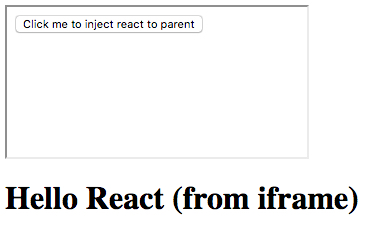

JavaScript React Inject Component Append to Parent Demo
=======================================================

在iframe引用的内页中，如何将某个react component附加到外层页面的body最后。

```
npm install
npm run demo
```


